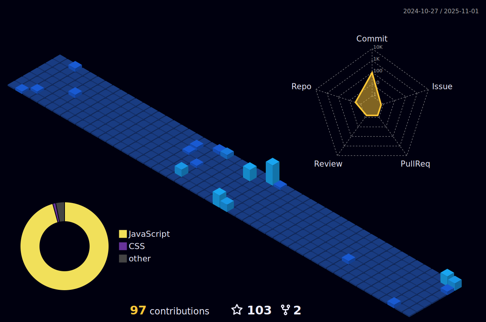

<h2 align="left"><strong>Seja muito bem-vindo(a)!</strong></h2>

 

###

Olá, 👋! Sou Hércules Chaves, um desenvolvedor Full Stack e empenhado em transformar minha jornada militar em uma carreira tecnológica. 🌐✨

<strong>Sobre minha jornada:</strong>

🛠️ Especialidade em Front-End: Minha paixão pelo desenvolvimento impulsiona-me a criar projetos inovadores e a encontrar soluções para desafios complexos.
Experiência Profissional:

💂‍♂️ Exército Brasileiro: Na estabelecida instituição, exerço minha função na esfera administrativa como Gestor de Protocolos Documentais, além de atuar como Auxiliar da Assessoria de Gestão de Processos e Riscos. Também desempenho um papel vital na área de Tecnologia da Informação.

💼 Freelancer com Propósito: Além dos estudos, atuo como freelancer, contribuindo na criação de páginas e construção de lojas virtuais, ganhando experiência prática em diversos ambientes profissionais.

<strong>Tecnologias que domino:</strong>

🌐 Front-End: HTML5, CSS3, JavaScript, TypeScript, ReactJS, Bootstrap, Styled-Components, Material UI, Radix

🖥️ Back-End: NodeJS, Express, PostgreSQL, Docker, Sequelize, MongoDB, Java, Spring Boot, Python, C++.

🔄 Versionamento e Colaboração: Git, Github.

📦 Outras Ferramentas: API Rest, RESTFULL.

<strong>Próximos Passos:</strong>

Estou entusiasmado para seguir minha carreira na área de tecnologia, pronto para enfrentar novos desafios e continuar aprendendo. Acredito que a evolução constante é crucial para o sucesso como desenvolvedor.

Se você busca um profissional dedicado, apaixonado por tecnologia, com uma base sólida em desenvolvimento FULL-STACK, estou pronto para contribuir com minha energia e habilidades para o sucesso. 💻💡

<strong>🚀 Estou aquecido em seguir minha carreira na área de tecnologia, continuando a aprender e evoluir como desenvolvedor. Vamos construir coisas incríveis juntos!</strong>

 
  
  
   
   

<h3>Conhecimento nas tecnologias e flameworks:</h3>
  

  

  ###

  
  
 |  |  |  
 | ----------- | ----------- |
  

  
  

  

   

     
  

  

  

   

  
  

  

